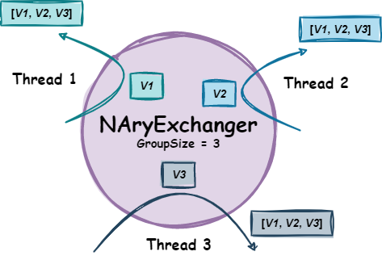
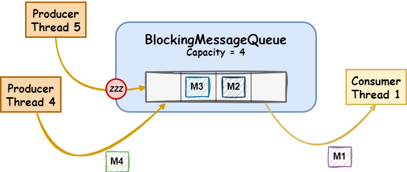

# Concurrent Programming - Summer 22/23

> This document contains the relevant observations and technical documentation of the problem sets resolution.

> Student: `49428 - Francisco Engenheiro - LEIC41D`

## Table of Contents 
- [Set1](#set1)
  - [NaryExchanger](#naryexchanger)
  - [BlockinMessageQueue](#blockingmessagequeue)

## Set1
### NaryExchanger
This exchanger implementation is similar to the [Java Exchanger](https://docs.oracle.com/javase/7/docs/api/java/util/concurrent/Exchanger.html), but it allows to exchange generic values between an arbitrary group of threads instead of just two. It also allows for each thread to specify a willing-to-wait timeout for the exchange operation to complete.

The exchanger is able to create another group when the previous group was completed, and even if all the threads associated with the old group don't know yet, the group was completed. 

A group is completed if the number of threads required to complete the group equals the specified group size.

In the following image, an example can be seen of such iteraction between the exchanger and a set of threads.

<center>

|  |
|:------------------------------------------------------:|
|                *NAryExchanger example*                 |

</center>

Public Interface:
```kotlin
class NAryExchanger<T>(groupSize: Int) {
    @Throws(InterruptedException::class)
    fun exchange(value: T, timeout: Duration): List<T>?
}
```

Style of syncronization: 
- For this syncronizer the `Kernel-style` or `Delegation of execution` was used in form of a `Request`, which represents a group in this context.
- Since the thread that completes the group is the one that signals the other threads that such condition is now true, thus completing their request, a delegation of execution was used, and as such, the other threads in the group aren't required to alter the state of the `Exchanger` or their own state when they return from the *await*.
- The described `Request` is defined as follows:
    ```kotlin
    private class Request<T>(
        val condition: Condition,
        val values: MutableList<T> = mutableListOf(),
        var isGroupCompleted: Boolean = false
    )
    ```

Normal execution:
- A thread calls `exchange` and awaits, within a timeout duration, for `groupSize` threads to call `exchange` as well.
- When `groupSize` threads have called `exchange`, the values are exchanged and the threads resume their respective work.

Conditions of execution:
- If a thread calls `exchange` and:
    - it was the last thread to join the group, thus completing it, it then *signals* all the threads of said group, and returns with the exchanged values (***fast-path***).
    - a group is not ready to be completed, the thread passively waits for that condition to be true (***wait-path***). In the meantime if:
      - the thread willing-to-wait time for the exchange to happen expires, `null` is returned and the thread is resumed.
      - the thread is *interrupted* while waiting for the exchange to complete, which means two things might happen, either:
        - the group was completed, and as such, the thread can't give-up and returns the values exchanged.
        - the group wasn't completed, and as such, the thread gives up, by removing the value it gave to the exchanged group, and throws an `InterruptedException`.

### BlockingMessageQueue
This syncronizer is a blocking queue that allows for multiple threads to concurrently enqueue and dequeue messages. It also allows for each thread to specify a willing-to-wait timeout for the enqueue and dequeue operations to complete.

In the following image, an example can be seen of such iteraction between the queue and a set of threads.

<div align="center">

|  |
|:--------------------------------------------------------------------:|
|                    *BlockingMessageQueue example*                    |

</div>

Public Interface:
```kotlin
class BlockingMessageQueue<T>(private val capacity: Int) {
    @Throws(InterruptedException::class)
    fun tryEnqueue(message: T, timeout: Duration): Boolean
    @Throws(InterruptedException::class)
    fun tryDequeue(nOfMessages: Int, timeout: Duration): List<T>?
}
```

Style of syncronization:
- For this syncronizer the `Kernel-style` or `Delegation of execution` was used in form of several `Requests`, which one representing a different condition:
  - `ProducerRequest` - represents a request to enqueue a message.
    ```kotlin
    private class ProducerRequest<T>(
        val message: T,
        val condition: Condition,
        var canEnqueue: Boolean = false
    )
    ```
  - `ConsumerRequest` - represents a request to dequeue a set of messages.
    ```kotlin
    private class ConsumerRequest<T>(
        val nOfMessages: Int,
        val condition: Condition,
        var messages: List<T> = emptyList(),
        var canDequeue: Boolean = false
    )
    ```

Normal execution:
- A thread calls `tryEnqueue` and expects to enqueue a message within the given timeout. 
- A thread calls `tryDequeue` and expects to dequeue a set of messages within the given timeout.

Conditions of execution:
- A thread calls `tryEnqueue` and:
    - the *message queue* is not full, and the thread is the head of the *producer requests queue*, the thread enqueues the message and returns `true` (***fast-path***). In this path the thread also checks if there are any `Consumer requests` that can be completed, and if so, it completes them.
    - the *message queue* is full, or the thread is not the head of the *producer requests queue*, and as such, the thread passively awaits to be able to enqueue the message (***wait-path***). In the meantime if:
        - the thread willing-to-wait time for the enqueue to happen expires, it removes its request and checks if the next `Producer request` can be completed, if so completes it, and always returns `false`.
        - the thread is *interrupted* while waiting to enqueue the message, which means two things might happen, either:
            - its request was completed by another thread, and as such, the thread can't give-up and enqueues the message and checks if there are any `Consumer requests` that can be completed. If there are, it completes them, and always returns `true`.
            - its request wasn't completed, and as such, the thread gives up by removing its request from the *producer requests queue*. Since giving up might create conditions for other threads to procede, this thread also checks if the next `Producer request` can be completed, if so completes it. Finally, the thread throws an `InterruptedException`.


- A thread calls `tryDequeue` and:
    - the *message queue* has at least `nOfMessages` messages, and the thread is the head of the *consumer requests queue*, the thread dequeues the messages and returns them (***fast-path***). In this path the thread also checks if the next `Producer request` can be completed, and if so, it completes it.
    - the *message queue* has less than `nOfMessages` messages, or the thread is not the head of the *consumer requests queue*, and as such, the thread passively awaits to be able to dequeue the messages (***wait-path***). In the meantime if:
        - the thread willing-to-wait time for the dequeue to happen expires, it removes its request and checks if the are `Consumer request` to be completed, if so completes them, and always returns `null`.
        - the thread is *interrupted* while waiting to dequeue the messages, which means two things might happen, either:
            - its request was completed by another thread, and as such, the thread can't give-up and dequeues the messages and checks if the next `Producer request` can be completed. If there is, it completes it, and always returns the `dequeued messages`.
            - its request wasn't completed, and as such, the thread gives up by removing its request from the *consumer requests queue*. Since giving up might create conditions for other threads to procede, this thread also checks if the other `Consumer requests` can be completed, if so completes them. Finally, the thread throws an `InterruptedException`.