# Concurrent Programming - Summer 22/23

> This document contains the relevant observations and technical documentation of the problem sets resolution.

- Student: `49428 - Francisco Engenheiro - LEIC41D`

## Table of Contents

1. [Background concepts and definitions](#background-concepts-and-definitions)
    - [Monitor vs Kernel Syncronization style](#monitor-vs-kernel-syncronization-style)
    - [Lock-based vs Lock-free algorithms](#lock-based-vs-lock-free-algorithms)
    - [Direct Style vs Continuation Passing style](#direct-style-vs-continuation-passing-style)
    - [Coroutines and Sequential Asynchronous Programming](#coroutines-and-sequential-asynchronous-programming)
2. [Set-1](#set-1)
    - [NAryExchanger](#naryexchanger)
    - [BlockinMessageQueue](#blockingmessagequeue)
    - [ThreadPoolExecutor](#threadpoolexecutor)
    - [ThreadPoolExecutorWithFuture](#threadpoolexecutorwithfuture)
        - [Promise](#promise)
3. [Set-2](#set-2)
    - [CyclicBarrier](#cyclicBarrier)
    - [ThreadSafeContainer](#threadsafecontainer)
    - [ThreadSafeCountedHolder](#threadsafecountedholder)
    - [LockFreeCompletionCombinator](#lockfreecompletioncombinator)
4. [Set-3](#set-3)
    - [Base implementation design](#base-implementation-design)
    - [Functionality](#functionality)
        - [Base Functionality](#base-functionality)
        - [Additional Functionality](#additional-functionality)
    - [Requirements](#requirements)
    - [Solution](#solution)
        - [AsyncMessageQueue](#asyncmessagequeue)
        - [Asynchronous Socket Extension Functions](#asynchronous-socket-extension-functions)
        - [Demonstration](#demonstration)

## Background Concepts and Definitions

This section presents a collection of concepts and definitions
that were utilized throughout the project to address the problem sets.
While the resolution of the problem sets incorporated additional concepts and definitions,
the ones listed below have been documented as their understanding was crucial
and formed the foundation for solving them.

### Monitor vs Kernel Syncronization style

In the `Monitor` style of synchronization, the thread that creates or sees favorable conditions for other threads to
advance
to the next state signals those threads.
It is the responsibility of those other threads to complete their own request of sorts after they exit the condition
where they were waiting upon.

In the `Kernel` or `Delegation of execution` synchronization style,
the thread that creates or sees favorable conditions for other threads to advance to the next state is responsible
for completing the requests of those other threads.
In successful cases,
the threads in the dormant state that were signaled do not have
to do anything besides confirming that their request was completed and return immediately from the synchronizer.
This style of synchronization is usually associated with one or more requests
that a thread or threads want to see completed,
and they delegate that completion to another thread, while keeping a local reference to that request, which then enables
the synchronizer to resume its functions without waiting for said requests to be completed.

For general purpose, the kernel-style is the preferred one,
since it is more flexible and easier to implement, but the choice will always be dependent
on the context of the synchronization problem.

### Lock-based vs Lock-free algorithms

The lock-based algorithms use a `lock` to ensure that only one thread can access the shared state at a given time.

#### Intrinsic vs Explicit locks

- synchronized blocks (*intrinsic lock*)
    ```kotlin
    synchronized(lock) {
       // code to be synchronized
    }
    ```
- synchronized methods (*intrinsic lock*)
    ```kotlin
    @Synchronized 
    fun method() {
        // code to be synchronized
    }
    ```
- ReentrantLock (*explicit lock*)
    ```kotlin
    // Or any other Lock interface implementation
    val lock: Lock = ReentrantLock()
    fun method() = lock.withLock {
        // code to be synchronized
    }
    ```

Meanwhile, the lock-free algorithms are based on atomic operations that ensure that multiple threads can access shared
state concurrently without interfering with each other.
This allows for efficient concurrent access without the overhead and potential contention of locking mechanisms.
Most algorithms use atomic variables and retry loops to achieve this.

#### Volatile vs Atomic

When a variable is marked as `volatile`, any *write* to that variable is immediately visible to all other threads,
and any *read* of that variable is guaranteed to see the most recent write
(*[happens-before relation](https://docs.oracle.com/javase/specs/jls/se8/html/jls-17.html#jls-17.4.5)*).
The guarantee of visibility is only for the variable itself,
not for the state of the object it refers to or any other variables.
This is guaranteed by the [Java Memory model](https://docs.oracle.com/javase/specs/jls/se8/html/jls-17.html),
which is then implemented by the `Java Virtual Machine`.

```kotlin
@Volatile
var sharedState: Any = Any()
```

[Atomic](https://docs.oracle.com/javase/8/docs/api/index.html?java/util/concurrent/atomic/package-summary.html)
variables
are implicitly *volatile* and guarantee atomicity of operations on them.

Some examples of atomic variables are `AtomicInteger`, `AtomicBoolean` and `AtomicReference`.
These variables have special methods for atomic operations, like `compare-and-set` which guarantee that their state will
always
be consistent and synchronized between threads.

```kotlin
val sharedState: AtomicReference<Any> = AtomicReference(Any())
```

|  |
|:---------------------------------------------------------------------:|
|                         *Volatile vs Atomic*                          | 

#### Implementation examples

An example of a lock-based and a lock-free implementation of a business logic
that updates a shared state can be seen in the following code snippets:

```kotlin
object LockBasedImplementation {
    val lock: Lock = ReentrantLock()
    var sharedState: Any = Any()
    fun updateState() = lock.withLock {
        logic(sharedState)
    }
}
```

```kotlin
object LockFreeImplementation {
    val sharedState: AtomicReference<Any> = AtomicReference(Any())
    fun updateState() {
        while (true) {
            val observedState = sharedState.get()
            val nextState = if (condition) {
                logic(observedState)
            } else {
                failureLogic()
            }
            // applies the next state to the shared state if the observed 
            // value corresponds to the value present in the shared state
            if (sharedState.compareAndSet(observedState, nextState)) {
                successLogic()
                return // or any other exit condition of the retry loop when done
            }
            // retry
        }
    }
}
```

### Direct Style vs Continuation Passing Style

Direct style is a programming style that closely resembles synchronous code. It allows developers to write code in a
straightforward and sequential manner. With direct style, the focus is on expressing the desired sequence of operations
without explicitly dealing with the asynchronous nature of the underlying operations.

Continuation passing style, often abbreviated as CPS, is an alternative programming style that emphasizes explicit
control flow and handling of continuations. In CPS, the flow of control is explicitly passed as a continuation to the
subsequent code that should be executed after an asynchronous operation completes.

In continuation passing style, coroutines are implemented by explicitly passing a continuation function to the
asynchronous operation. The continuation function represents the next step of the computation and is invoked once the
asynchronous operation completes. This style of programming often involves nesting or chaining of continuation functions
to express the desired sequence of operations.

CPS provides a fine-grained control over the flow of execution,
allowing developers to handle complex scenarios and perform custom control flow manipulation.
However, CPS code can become convoluted and harder to read as the number of
continuations [increases](#coroutines-and-sequential-asynchronous-programming)

In *Kotlin*, [suspending functions](https://kotlinlang.org/docs/composing-suspending-functions.html) are implemented
using continuation passing style. The compiler transforms the code of a suspending function into a state machine that
uses continuations to represent the next step of the computation. The compiler also generates the necessary code to
resume the state machine once the asynchronous operation completes.

The next image provides a visual comparison between direct style and continuation passing style:

| 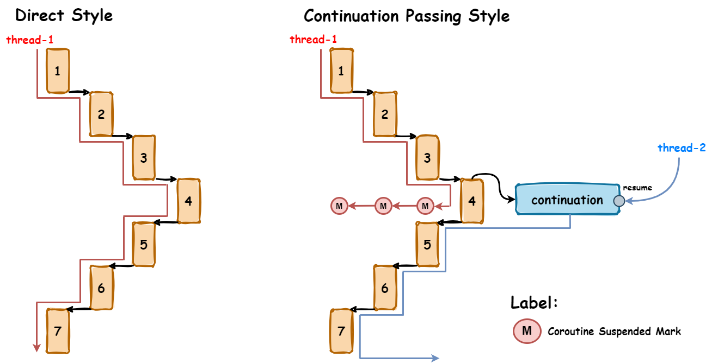 |
|:----------------------------------------------------------------------------------------------:|
|                                     *Direct Style vs CPS*                                      |

Overall, both direct style and continuation passing style have their merits and use cases in coroutines and sequential
asynchronous programming. Direct style offers simplicity and a natural flow of code, while continuation passing style
provides explicit control over the flow of execution. The choice between these styles depends on the specific
requirements of the application and the desired balance between readability and control.

### Coroutines and Sequential Asynchronous Programming

Coroutines are a concurrency design pattern that allows the execution of code in a non-blocking manner, facilitating the
handling of asynchronous operations. The utilization of coroutines enables the development of asynchronous code that
appears to be sequential, providing a more intuitive and straightforward programming experience.

Traditionally, asynchronous programming often involves complex callback mechanisms or the usage of threading primitives,
which can lead to convoluted and error-prone code. Coroutines offer an alternative approach that allows developers to
write asynchronous code in a more linear and sequential style.

With coroutines, you can write code that looks similar to synchronous code, with explicit flow control using constructs
like loops, conditionals, and function calls. This sequential appearance is achieved through the use of suspending
functions, which can pause their execution and resume later without blocking the underlying thread.

Coroutines rely on concepts like suspending functions and the concept of await, which allows for the suspension of a
coroutine until a specific asynchronous operation completes. This way, you can express complex asynchronous workflows in
a more readable and structured manner.

By using coroutines, callback hell can be avoided and improve code readability, making asynchronous code more
maintainable and easier to reason about. Coroutines also provide additional benefits like structured error handling and
support for cancellation, which further enhance the development of robust asynchronous code.

Below is an example of using callbacks to execute two HTTP requests only if the previous one was successful, and the
same example using coroutines.

```kotlin
fun method() {
    val url = "https://someurl.com"
    val client = OkHttpClient()
    val request = Request.Builder().url(url).build()
    client.newCall(request).enqueue(object : Callback {
        override fun onFailure(call: Call, e: IOException) {
            println("Failed to execute request")
        }

        override fun onResponse(call: Call, response: Response) {
            val body = response.body?.string()
            println(body)

            // Nested callback
            client.newCall(request).enqueue(object : Callback {
                override fun onFailure(call: Call, e: IOException) {
                    println("Failed to execute nested request")
                }

                override fun onResponse(call: Call, response: Response) {
                    val nestedBody = response.body?.string()
                    println(nestedBody)
                    // more callbacks
                }
            })
        }
    })
}
```

Same example with coroutines:

```kotlin
suspend fun method() {
    val url = "https://someurl.com"
    val client = OkHttpClient()
    val request = Request.Builder().url(url).build()

    // Sequential execution
    val response = client.newCall(request).await()
    val body = response.body?.string()
    println(body)

    // Sequential execution
    val nestedResponse = client.newCall(request).await()
    val nestedBody = nestedResponse.body?.string()
    println(nestedBody)
}
```

## Set-1

## NAryExchanger

[Implementation](src/main/kotlin/pt/isel/pc/problemsets/set1/NAryExchanger.kt) | [Tests](src/test/kotlin/pt/isel/pc/problemsets/set1/NAryExchangerTests.kt)

### Description

This exchanger implementation is similar to
the [Java Exchanger](https://docs.oracle.com/javase/7/docs/api/java/util/concurrent/Exchanger.html), but it allows to
exchange generic values between
an arbitrary group of threads instead of just two. It also allows for each thread to specify a willing-to-wait
timeout for the exchange operation to complete.

The exchanger is able to create multiple groups of threads with the same specified size upon creation,
and each thread can only exchange values with the threads of its group.

A group is completed if the number of threads required to complete the group equals the specified group size.

### Public interface:

```kotlin
class NAryExchanger<T>(groupSize: Int) {
    @Throws(InterruptedException::class)
    fun exchange(value: T, timeout: Duration): List<T>?
}
```

In the following image, an example can be seen of such iteraction between the exchanger and a set of threads.

|  |
|:------------------------------------------------------------:|
|                   *NAryExchanger example*                    |

### Style of synchronization:

For this synchronizer the `Kernel-style` or `Delegation of execution` was used in form of a `Request`, which
represents a group in this context.

A delegation of execution was used, because it's easier for the thread that completes the group to signal all the other
threads of that group, that such condition is now true, thus completing their request, and as such, the other threads in
the group aren't
required to alter the state of the `Exchanger` or their own state when they return from *await* (as they would
in `Monitor Style`).

Also, the `Kernel-style` allows for the exchanger to keep creating new groups without keeping track of the previous
ones, as the threads of each group keep a local reference to their respective request object.

The described `Request` is defined as follows:

```kotlin
private class Request<T>(
    val condition: Condition,
    val values: MutableList<T> = mutableListOf(),
    var isGroupCompleted: Boolean = false
)
```

### Normal execution:

- A thread calls `exchange` and awaits, within a timeout duration, for `groupSize` threads to call `exchange` as well.
- When `groupSize` threads have called `exchange`, the values are exchanged and the threads resume their respective
  work.

### Conditions of execution:

- **Paths** - The thread can take two major paths when calling `exchange`:
    - the thread is the last thread to join the group, thus completing it, and as such, it returns with the exchanged
      values (***fast-path***).
    - a group is not ready to be completed, the thread passively awaits for that condition to be true (***wait-path***).
- **Giving-up** - While waiting, a thread can *give-up* on the exchange operation if:
    - the thread is interrupted while waiting for the group to be completed and throws an `InterruptedException`.
    - the thread willing-to-wait timeout expires and returns `null`.
- **Additional notes**:
    - If a thread is interrupted but the group is completed, it will still return the exchanged values but will throw
      an `InterruptedException` if blocked again (since the interrupt flag is rearmed).
    - A thread that specifies a timeout of *zero* will not wait for the group to be completed and will return `null`
      immediately if it did not complete the group.

## BlockingMessageQueue

[Implementation](src/main/kotlin/pt/isel/pc/problemsets/set1/BlockingMessageQueue.kt) | [Tests](src/test/kotlin/pt/isel/pc/problemsets/set1/BlockingMessageQueueTests.kt)

### Description

This synchronizer is a blocking queue,
similar to
an [LinkedBlockingQueue](https://docs.oracle.com/javase/7/docs/api/java/util/concurrent/LinkedBlockingQueue.html)
that allows for multiple threads to concurrently enqueue and dequeue messages.
It also allows for each thread to specify a willing-to-wait timeout for the enqueue and dequeue operations to complete.

The term *blocking* refers to the fact that the queue is bounded,
and as such, if a thread tries to enqueue a message when the queue is full,
or tries to dequeue a message when the queue is empty,
it will block until the queue is not full or not empty, respectively.

This type of synchronizer is useful when dealing in scenarios with multiple producers and consumer threads that want
to exchange messages, and as such, it is important to ensure that those messages are enqueued and dequeued in the order
of arrival, because of that the queue was implemented using FIFO (*First In First Out*) ordering.

### Public interface:

```kotlin
class BlockingMessageQueue<T>(private val capacity: Int) {
    @Throws(InterruptedException::class)
    fun tryEnqueue(message: T, timeout: Duration): Boolean

    @Throws(InterruptedException::class)
    fun tryDequeue(nOfMessages: Int, timeout: Duration): List<T>?
}
```

In the following image, an example can be seen of the iteraction between the blocking queue and a set of producer and
consumer threads.

| 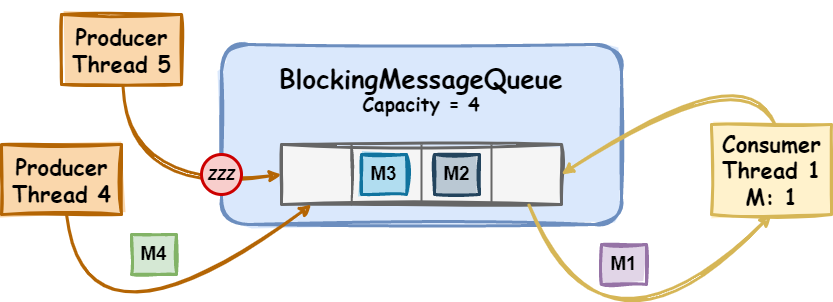 |
|:---------------------------------------------------------------------------:|
|                       *BlockingMessageQueue example*                        |

### Style of synchronization:

For this synchronizer the `Kernel-style` or `Delegation of execution` was used in form of several `Requests`,
which one representing a different condition:

- `ProducerRequest` - represents a *Producer Thread* request to enqueue a message.

  ```kotlin
  private class ProducerRequest<T>(
      val message: T,
      val condition: Condition,
      var canEnqueue: Boolean = false
  )
  ```
- `ConsumerRequest` - represents a *Consumer Thread* request to dequeue a set of messages.

  ```kotlin
  private class ConsumerRequest<T>(
      val nOfMessages: Int,
      val condition: Condition,
      var messages: List<T> = emptyList(),
      var canDequeue: Boolean = false
  )
  ```

The delegation is used in the sense where the *Consumer thread* that dequeues the messages is the one that signals all
*Producer
threads*, that were waiting to enqueue a message, and completes their request if it can be completed, because it altered
the
state of the synchronizer and because of that it might have created conditions that allow other threads to complete
their requests.
This process works in both ways, where a *Producer thread* should complete all *Consumer thread requests* if they can be
completed.

Since each thread submits a request to its respective queue, *specific signalling* is used here where the threads can
signal
each other instead of a single condition, which is more efficient because it reduces the number of threads that are
woken up
when a condition is met only to find their request is not the one that was completed.

In this context, there's also a special case where if a *Consumer Thread* gives up, either by timeout or interruption,
not
only it should remove its request from the *consumer requests queue*,
but also it should signal all *Consumer Threads*, that were waiting to dequeue a set of messages, and complete their
request if it can be completed.

The following image tries to illustrate an example of the described special delegation.

|  |
|:--------------------------------------------------------------------------------------------------------------------------------:|
|                                                  *Consumer Special delegation*                                                   |

In this example, **Consumer Thread 1** is waiting to dequeue **4 messages**, but the *queue* **only** has 3 messages
available.
Since no *Producer Thread* enqueued the final message to complete its request,
within the given timeout, the thread gives up.

In the process of giving up, the thread removes its request from the *consumer requests queue*,
and completes all *Consumer Thread* requests that can be completed, in this example, **Consumer Thread 2** only.

Since delegation style was used in this synchronizer,
not doing what was described would result in an invalid state of the synchronizer,
where a ***liveliness*** property is violated,
since there are enough messages in the *message queue* to complete the request of **Consumer Thread 2**
but the thread is not signaled and subsequently its request is not completed.

We could think similarly about the *Producer Thread* requests, where if a *Producer Thread* gives up, either by timeout
or interruption,
not only it should remove its request from the *producer requests queue*, but also it should signal the next *Producer
Threads* in the
queue and complete their request if it could be completed.
But in this case,
it's different
because the *Producer Thread* that gave-up submitted a request that is equals to all other *Producer Thread* requests,
and as such, it cannot assume that the next *Producer Thread* request in the queue can be completed.

### Normal execution:

- A thread calls `tryEnqueue` and expects to enqueue a message within the given timeout.
- A thread calls `tryDequeue` and expects to dequeue a set of messages within the given timeout.

### Conditions of execution:

`tryEnqueue`:

- **Paths** - The thread can take two major paths when calling this method:
    - **fast-path**
        - there's a consumer thread that is waiting to dequeue a single message, and as such, the thread delivers the
          message directly and returns `true`.
        - the *message queue* is not full, and the thread is the head of the *producer requests queue*, the thread
          enqueues the message and returns `true`.
    - **wait-path** - the *message queue* is full, or the thread is not the head of the *producer requests queue*, and
      as such, the thread passively awaits to be able to enqueue the message.
- **Giving-up** - While waiting, a thread can *give-up* on the enqueue operation if:
    - the thread is interrupted while waiting for the queue to be not full and throws an `InterruptedException`.
    - the thread willing-to-wait timeout expires and returns `false`.
- **Additional notes**:
    - If a thread is interrupted but another thread completed this thread request to enqueue a message, it will still
      return `true` but will throw an `InterruptedException` if blocked again (since the interrupt flag is rearmed).
        - A thread that specifies a timeout of *zero* will not wait and will return `false` immediately if it did not
          enqueue the message.

`tryDequeue`:

- **Paths** - The thread can take two major paths when calling this method:
    - the *message queue* has at least `nOfMessages` messages, and the thread is the head of the *consumer requests
      queue*, the thread dequeues the messages and returns them (***fast-path***).
    - the *message queue* has less than `nOfMessages` messages, or the thread is not the head of the *consumer requests
      queue*, and as such, the thread passively awaits to be able to dequeue the messages (***wait-path***).
- **Giving-up** - While waiting, a thread can *give-up* on the dequeue operation if:
    - the thread is interrupted while waiting for the queue to be not empty and throws an `InterruptedException`.
    - the thread willing-to-wait timeout expires and returns `null`.
- **Additional notes**:
    - If a thread is interrupted but another thread completed this thread request to dequeue a set of messages, it will
      still return those messages, but will throw an `InterruptedException` if blocked again (since the interrupt flag
      is rearmed).
        - A thread that specifies a timeout of *zero* will not wait and will return `null` immediately if it did not
          dequeue the number of requested messages.

## ThreadPoolExecutor

[Implementation](src/main/kotlin/pt/isel/pc/problemsets/set1/ThreadPoolExecutor.kt) | [Tests](src/test/kotlin/pt/isel/pc/problemsets/set1/ThreadPoolExecutorTests.kt)

### Description

This synchronizer is similar to the
Java [ThreadPoolExecutor](https://docs.oracle.com/javase/7/docs/api/java/util/concurrent/ThreadPoolExecutor.html)
that allows outside threads to delegate the execution of a task to other threads - *worker threads* - that it manages.

The executor has a dynamic worker thread pool size from `0` to `maxThreadPoolSize`.
The worker threads are created lazily,
and as such,
when a task is delegated to the executor
and there are no available worker threads and the maximum pool size has not been reached, only then a new worker thread
is created.

The tasks are executed using the
[Runnable](https://docs.oracle.com/javase/7/docs/api/java/lang/Runnable.html) interface,
and as such, the executor does not return any value to the caller.
If no work is delegated to the executor, the worker threads will be kept alive, waiting for work, for a maximum of
`keepAliveTime` before being terminated and removed from the pool by the executor.

### Public interface

```kotlin
class ThreadPoolExecutor(
    private val maxThreadPoolSize: Int,
    private val keepAliveTime: Duration,
) {
    @Throws(RejectedExecutionException::class)
    fun execute(runnable: Runnable)
    fun shutdown()

    @Throws(InterruptedException::class)
    fun awaitTermination(timeout: Duration): Boolean
}
```

The following image shows how a task (**R**), that is delegated to a worker thread is executed within the thread pool.

|  |
|:------------------------------------------------------------------------:|
|                      *ThreadPoolExcecutor example*                       |

### Style of synchronization

- In this synchronizer, the `Monitor Style` was used to synchronize the *worker threads*.
  Each thread alters the state of the
  synchronizer and doesn't delegate the alteration of that state to another thread.

### Lifecycle

The executor has a lifecycle that can be described by the following states:

|  |
  |:--------------------------------------------------------------------:|
|                     *ThreadPoolExecutor states*                      |

- **Ready** - the executor is accepting tasks to be executed. Outside threads can delegate tasks to the thread pool
  using the `execute` method.
- **Shutting down** - the executor is in shutdown mode, and as such, is not accepting tasks to be executed, but it's
  still executing the tasks that were already delegated to it. This process is started by calling the `shutdown` method.
- **Terminated** - the thread pool has finished the shutdown process and terminates. All tasks that were delegated to it
  prior to the shutdown process have been executed with success or failure. An outside thread can synchronize with this
  termination process by calling the `awaitTermination` method.

### Normal execution:

- A thread calls `execute` and leaves, expecting the task to be executed by a worker thread within the time limit.
- A thread calls `shutdown`, expecting the thread pool to start shutting down.
- A thread calls `awaitTermination` and awaits, for a time duration, for the thread pool to terminate.

### Conditions of execution:

`shutdown`:

- In the first and only effective call to `shutdown` method, the executor is responsible to signal all the threads
  waiting,
  for more tasks to be delegated to them that the executor is shutting down, and they should clear the queue of tasks
  and
  terminate if no more work is available.

`awaitTermination`:

- **Paths** - The thread can take two major paths when calling this method:
    - the thread pool has already terminated, and as such, the thread returns `true` immediately (***fast-path***).
    - the thread pool hasn't terminated yet, and as such, the thread passively awaits for the thread pool to terminate (
      ***wait-path***).
- **Giving-up** - While waiting, a thread can *give-up* on the executor shutdown operation if:
    - the thread willing-to-wait timeout expires and returns `false`.
- **Additional notes**:
    - the thread is interrupted while waiting and throws an `InterruptedException`.
    - a thread that specifies a timeout of *zero* will not wait for the executor to shut down and will return `false`
      immediately.
    - the last thread to terminate is also responsible to signal all the threads waiting for the executor to shut down.

## ThreadPoolExecutorWithFuture

[Implementation](src/main/kotlin/pt/isel/pc/problemsets/set1/ThreadPoolExecutorWithFuture.kt) | [Tests](src/test/kotlin/pt/isel/pc/problemsets/set1/ThreadPoolExecutorWithFutureTests.kt)

### Description

This synchronizer is similar to the [ThreadPoolExecutor](#threadpoolexecutor), but instead of
[Runnable](https://docs.oracle.com/javase/7/docs/api/java/lang/Runnable.html) tasks,
it accepts [Callable](https://docs.oracle.com/javase/8/docs/api/java/util/concurrent/Callable.html) tasks
that return a value or throw an exception.

### Public interface

```kotlin
class ThreadPoolExecutorWithFuture(
    private val maxThreadPoolSize: Int,
    private val keepAliveTime: Duration,
) {
    fun <T> execute(callable: Callable<T>): Future<T>
    fun shutdown()

    @Throws(InterruptedException::class)
    fun awaitTermination(timeout: Duration): Boolean
}
```

The following image shows how a task (**C**),
that is delegated to a worker thread
is executed within the thread pool.
A representative (**F**) of the task execution is returned to the outside thread that delegated the task.

| 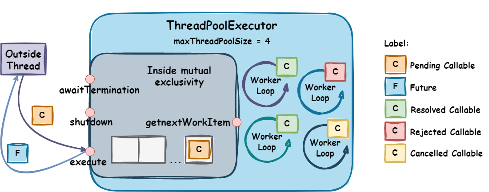 |
|:----------------------------------------------------------------------------------------------:|
|                            *ThreadPoolExcecutorWithFuture example*                             |

### Style of synchronization

- In this synchronizer, the `Monitor Style` was used to synchronize the *worker threads*.
  Each thread alters the state of the synchronizer when necessary and doesn't delegate the alteration of that state to
  another thread.
- Although it was used a `Request` to represent the task execution in the thread pool, that request completion
  is not being delegated to another thread. Once a worker thread has received a request, it is responsible to
  complete it in any way possible.

The described `Request` is as follows:

```kotlin
private class ExecutionRequest<T>(
    val callable: Callable<T>,
    val result: Promise<T> = Promise()
)
```

## Promise

[Implementation](src/main/kotlin/pt/isel/pc/problemsets/set1/Promise.kt) | [Tests](src/test/kotlin/pt/isel/pc/problemsets/set1/PromiseTests.kt)

### Description

In order to allow the outside threads to synchronize the result of the task execution,
the `execute` method of [ThreadPoolExecutorWithFuture](#threadpoolexecutorwithfuture) returns a
[Future](https://docs.oracle.com/javase/8/docs/api/java/util/concurrent/Future.html) implementation.

Instead of using already existing implementations,
this executor uses its own implementation of the `Future` interface -
a [Promise](https://developer.mozilla.org/en-US/docs/Web/JavaScript/Reference/Global_Objects/Promise) -
which provides a *Future* that is explicitly completed, and it can be resolved with a value, rejected with an exception
or cancelled.

### Public interface

```kotlin
class Promise<T> : Future<T> {
    override fun cancel(mayInterruptIfRunning: Boolean): Boolean
    override fun isCancelled(): Boolean
    override fun isDone(): Boolean

    @Throws(InterruptedException::class, CancellationException::class, ExecutionException::class)
    override fun get(): T

    @Throws(
        TimeoutException::class,
        InterruptedException::class,
        CancellationException::class,
        ExecutionException::class
    )
    override fun get(timeout: Long, unit: TimeUnit): T
    fun resolve(result: T)
    fun reject(ex: Throwable)
}
```

### Lifecycle

The promise has a lifecycle that can be described by the following states:

| 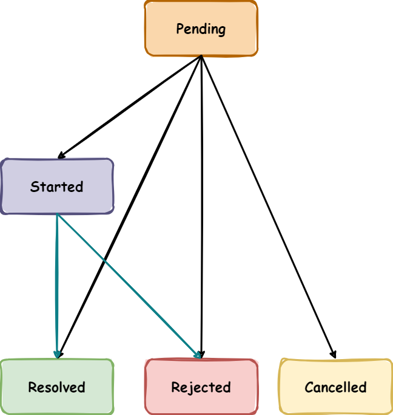 |
|:-------------------------------------------------------------:|
|                       *Promise states*                        |

- **Pending** - the promise is pending and has not yet produced a result.
- **Resolved** - the computation has completed successfully with the given value.
- **Rejected** - the computation has completed with a failure due to an exception.
- **Cancelled** - promise was cancelled before it could be completed.

Once the *promise* is resolved, rejected or cancelled, it cannot be altered.

### Style of synchronization

- In this synchronizer, the `Monitor Style` was used in the sense that the thread that alters the state of the promise
  is responsible to signal all threads that are waiting for that state to be altered for them to evaluate the state of
  the promise and act accordingly.

### Normal execution:

- A thread calls `cancel`, expecting the task to be cancelled.
- A thread calls `resolve`, expecting the task to be resolved with the given value.
- A thread calls `reject`, expecting the task to be rejected with the given exception.
- A thread calls `get`, expecting to retrieve the result of the task execution.

### Conditions of execution:

`get`:

- **Paths** - The thread can take two major paths when calling this method:
    - the task has already been completed, and as such, the thread receives the result of the task execution (*
      *fast-path**).
    - the task has not been completed, and as such, the thread passively awaits for that condition to be met (*
      *wait-path**).
- **Giving-up** - While waiting, a thread can *give-up* on the task execution if:
    - the thread willing-to-wait timeout expires and throws a `TimeoutException`.
    - the thread is interrupted while waiting and throws an `InterruptedException`.
- **Additional notes**:
    - A thread that specifies a timeout of *zero* and the promise is not yet ready, it will not wait for the promise
      to be completed and will throw a `TimeoutException`.
    - if a task has been completed:
        - but was cancelled, throws a `CancellationException`.
        - but was rejected, throws an `ExecutionException`.
        - but was resolved, returns the result of the task execution.

## Set-2

## CyclicBarrier

[Implementation](src/main/kotlin/pt/isel/pc/problemsets/set2/CyclicBarrier.kt) |
[Tests](src/test/kotlin/pt/isel/pc/problemsets/set2/CyclicBarrierTests.kt)

### Description

A [CycleBarrier](https://docs.oracle.com/javase/8/docs/api/java/util/concurrent/CyclicBarrier.html) is a synchronization
mechanism
that allows a set of threads to wait for each other to reach a common barrier point.
If provided, a `Runnable` task is executed once the last thread in the set arrives at the barrier.

The barrier is called *cyclic* because it can be re-used again after being broken for the next barrier generation.

Assuming a barrier is not opened yet, it can be *broken* for the following reasons:

- A thread waiting at the barrier is interrupted.
- A thread waiting at the barrier times out while waiting.
- The barrier was resetted, and there was at least one thead waiting at the barrier.
- If the execution of the runnable by the last thread, throws an exception.
- When a thread sets a timeout of zero and enters a non-broken barrier but does not complete it.

A new generation of the barrier is created *only* when:

- the last thread that enters the barrier and:
    - the runnable task executes successfully.
    - no runnable task was provided.
- the barrier is resetted.

### Public interface

```kotlin
class CyclicBarrier(
    private val parties: Int,
    private val barrierAction: Runnable?,
) {
    constructor(parties: Int) : this(parties, null)

    @Throws(InterruptedException::class, BrokenBarrierException::class)
    fun await(): Int

    @Throws(InterruptedException::class, TimeoutException::class, BrokenBarrierException::class)
    fun await(timeout: Duration): Int
    fun getNumberWaiting(): Int
    fun getParties(): Int
    fun isBroken(): Boolean
    fun reset()
}
```

The barrier has the following possible states for each barrier generation.

| 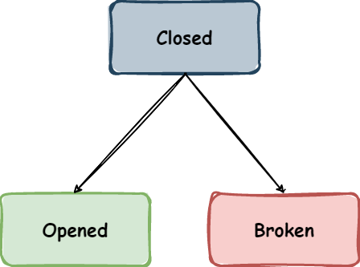 |
|:---------------------------------------------------------------------------:|
|                 *Cyclic Barrier possible generation states*                 |

### Style of synchronization

For this synchronizer the `Kernel-style` or `Delegation of execution` was used in form of a `Request` per barrier
generation,
because it's easier
for the last thread to enter the barrier
to signal all threads that are waiting for the barrier to be opened and thus completing their request.

This implementation enables the barrier to be reused for the next barrier generation without affecting the prior barrier
reference that the other threads have acquired before laying down their request.

As mentioned, the `CyclicBarrier` is a reusable barrier,
and as such, it is necessary to create another instance of the `Request` for the next barrier generation,
and that is done by the last thread to enter the barrier.
This thread is also responsible to execute the runnable task if it exists.
If the execution of the runnable task throws a `throwable`,
the barrier is broken and all threads waiting at the barrier are released with a `BrokenBarrierException`.

Because the threads are always signaled to leave the condition by either resetting the barrier or by opening it, the
condition where all threads are waiting for the barrier to be broken is also reused in subsequent barrier generations.

The described `Request` is defined as follows:

```kotlin
private class BarrierRequest(
    var nOfThreadsWaiting: Int = 0,
    var wasBroken: Boolean = false,
    var wasOpened: Boolean = false
)
```

The following image shows a possible representation of the previous states in a barrier with 3 parties.

| 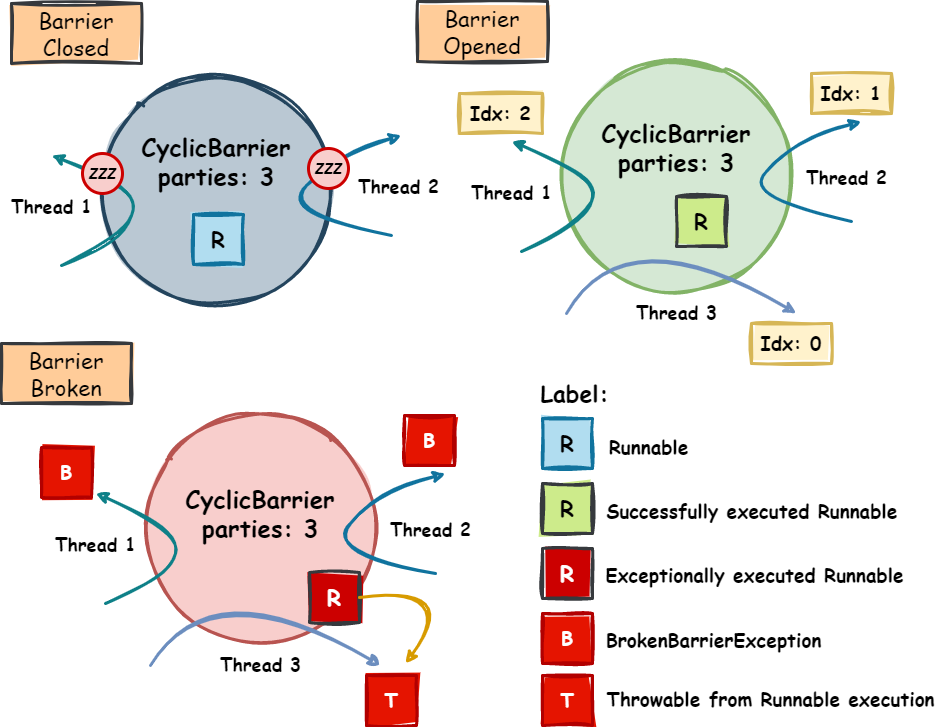 |
|:-------------------------------------------------------------:|
|                   *Cyclic Barrier example*                    |

### Normal execution:

- A thread calls `await`, and passively awaits indefinitely for the other threads to reach the barrier, in order for it
  to be opened and the runnable task to be executed if it exists. Returns the arrival index of this thread where:
    - `getParties() - 1` - for first thread to enter the barrier.
    - `0` - for last thread to enter the barrier.
- A thread calls `await` (with *timeout*), and awaits for a specified timeout for the other threads to reach the
  barrier, with the same behavior as the previous method.
- A thread calls `reset`, and resets the barrier for the next generation.
- A thread calls `getNumberWaiting`, and retrieves the number of threads that are waiting for the barrier to be opened.
- A thread calls `getParties`, and retrieves the number of threads that must invoke `await` in order for the barrier to
  be opened.
- A thread calls `isBroken`, and retrieves information about whether the barrier has been broken or not.

### Conditions of execution:

`await`:

- **Paths** - The thread can take three major paths when calling this method:
    - **fast-path**
        - the current barrier has already been broken, and as such, the thread throws a `BrokenBarrierException`.
        - the barrier has not yet been broken, and this thread is the last one to enter the barrier:
            - if a runnable task was provided and its execution throws a `throwable`, the barrier is broken, and all
              threads waiting at the barrier are released with a `BrokenBarrierException`, and the thread returns the
              same `throwable`.
            - if a runnable task was not provided, or its execution completes successfully, the barrier is opened, a new
              generation is created, and the thread returns `0`.
        - A thread that specifies a timeout of *zero* and does not complete the barrier will not wait for that event and
          throws a `TimeoutException` immediately.
    - **wait-path**
        - the barrier has not yet been broken, and this thread is not the last one to enter the barrier, and as such,
          the thread passively awaits for that condition to be met.
- **Giving-up** - While waiting for the barrier to be opened, a thread can *give-up* in the following cases:
    - the thread is interrupted and, as such, throws an `InterruptedException`, **if and only if** it was the first
      thread to be interrupted out of all the threads waiting for the barrier to be broken.
    - the thread is interrupted, and if the barrier was already broken by another thread, throws
      a `BrokenBarrierException`.
    - the thread timeout expires and throws a `TimeoutException`.

## ThreadSafeContainer

[Implementation](src/main/kotlin/pt/isel/pc/problemsets/set2/ThreadSafeContainer.kt) |
[Tests](src/test/kotlin/pt/isel/pc/problemsets/set2/ThreadSafeContainerTests.kt)

### Description

A thread-safe container is a container that allows multiple threads to consume the values it
contains using the `consume` method.

The container receives an array
of [AtomicConsumableValue](src/main/kotlin/pt/isel/pc/problemsets/set2/AtomicConsumableValue.kt)s,
that cannot be empty.
Each value has a number of lives that represent the number of times that value can be consumed by a thread.

A thread that consumes a value from the container
decreases the number of lives of that value by one or returns `null` if the container has no values left to consume.

When multiple threads try to consume a value from the container at the same time,
there's no guarantee which thread will consume the life of that value first.
Also,
a thread that tries to consume a value from a non-empty container could possibly never consume a value
if it keeps losing the race against other threads
that are also trying to the same, which could mean that the container might be emptied by other threads before it can
consume a value.
Although this is relevant to mention, it is not a problem because the container was not specified to be *fair*.
This event does not lead to *starvation* because the thread will return `null` and will not be blocked indefinitely.

### Public interface

```kotlin
class ThreadSafeContainer<T>(
    private val values: Array<AtomicConsumableValue<T>>
) {
    fun consume(): T
}
```

The following images illustrate the state of the container before and after a set of threads consume values from it,
as well as how a value is represented.

| 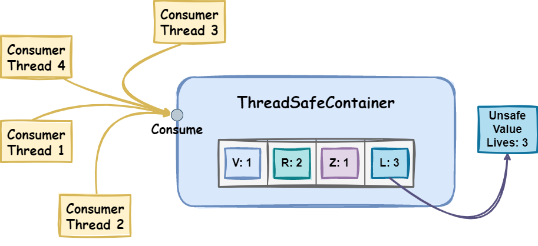 |
|:-----------------------------------------------------------------------------------------------------------------:|
|  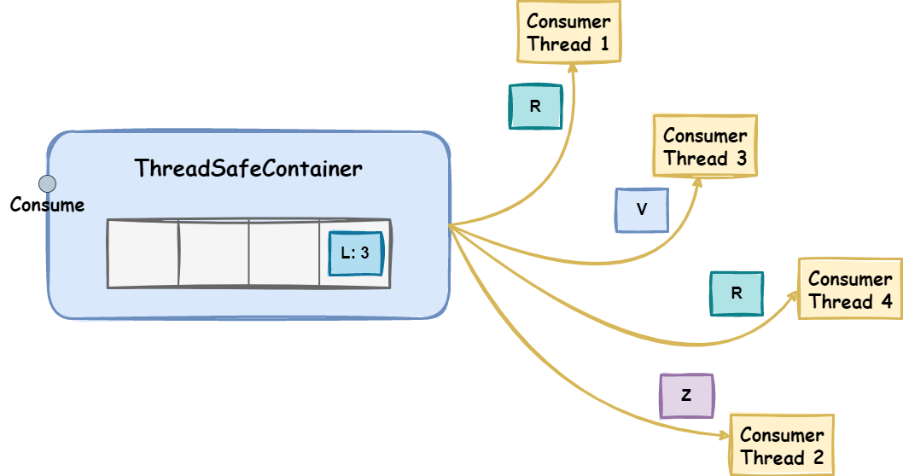  |
|                                          *Thread-Safe Container example*                                          |

### Style of synchronization

The implementation uses a lock-free *retry* style of synchronization,
where a thread that fails to consume a value from the container will retry until possible.

In the implementation,
both the `index` of the array of values and the `lives` property of each `value` were needed to be
updated atomically, and therefore both are represented by
an [AtomicInteger](https://docs.oracle.com/javase/8/docs/api/java/util/concurrent/atomic/AtomicInteger.html).

An implementation that is not *thread-safe*, and that was the starting point of this implementation, can be
seen [here](src/main/kotlin/pt/isel/pc/problemsets/unsafe/UnsafeContainer.kt).

### Normal execution:

- A thread calls `consume`, and consumes a value from the container, if there is any left or returns `null` if
  the container is empty.

### Conditions of execution:

`consume`:

- **Paths** - The thread can take two major paths when calling this method:
    - **fast-path**
        - the container has no values left to consume, and as such, null is returned.
    - **outer-retry-path**
        - the container has values left to consume, so the thread tries to decrement a life from the current index
          value until possible. This action is associated with an **inner-retry-path**, because the thread will keep
          trying
          to decrement the life of the current value until it is not possible, because some other thread(s) decremented
          all
          lives of this value and as such, this thread is forced to leave to the **outer-retry-path**. Back to the outer
          loop,
          the thread tries to decrement a life of the next value in the array if it exists, or returns null if the array
          was
          emptied in the meantime.

## ThreadSafeCountedHolder

[Implementation](src/main/kotlin/pt/isel/pc/problemsets/set2/ThreadSafeCountedHolder.kt) |
[Tests](src/test/kotlin/pt/isel/pc/problemsets/set2/ThreadSafeCountedHolderTests.kt)

### Description

A thread-safe-counted holder is a container
that holds a resource `value` that internally has a `counter` that specifies how many times the value was used.
If the counter reaches zero, the value is automatically *closed*, and since it implements the
[Closeable](https://docs.oracle.com/javase/8/docs/api/java/io/Closeable.html) interface, it can be closed
by calling the `close` method.

### Public interface

```kotlin
class ThreadSafeCountedHolder<T : Closeable>(value: T) {
    fun tryStartUse(): T?

    @Throws(IllegalStateException::class)
    fun endUse()
}
```

The following images illustrate the state of the holder when a thread tries to use the value that is not closed,
and after a thread decrements the usage counter of the value, and the counter reaches zero.

|         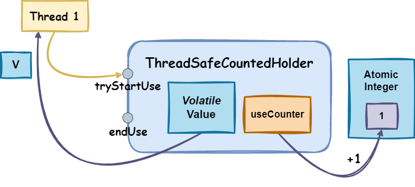         |
|:---------------------------------------------------------------------------------------------------------------------:|
| 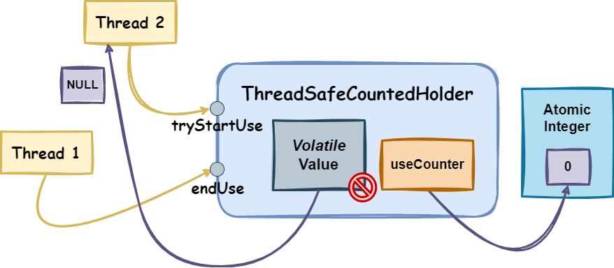 |
|                                         *Thread-Safe Counted Holder example*                                          |

### Style of synchronization

The implementation uses a lock-free *retry* style of synchronization,
where a thread that fails to increment/decrement the usage counter of the value will retry until possible.

The `usage counter` is incremented/decremented
atomically using
the [AtomicInteger](https://docs.oracle.com/javase/8/docs/api/java/util/concurrent/atomic/AtomicInteger.html) class
while the `value` itself was considered to be *volatile* and not atomic, as it provides the necessary guarantees of
thread-safety and visibility without incurring unnecessary overhead.

An implementation that is not thread-safe, and that was the starting point of this implementation,
can be seen [here](src/main/kotlin/pt/isel/pc/problemsets/unsafe/UnsafeUsageCountedHolder.kt).

### Normal execution:

- A thread calls `tryStartUse`, and retrieves the value if it is not closed, incrementing the usage counter.
- A thread calls `endUse`, and decrements the usage counter of the value, closing it if the counter reaches zero.

### Conditions of execution:

`tryStartUse`:

- **Paths** - The thread can take two major paths when calling this method:
    - **fast-path**
        - the `value` is already `null`, which means the resource was closed, and as such, null is returned (cannot be
          reused).
    - **retry-path**
        - the `value` is not closed, so this thread tries to increment the usage counter if possible, and if it is,
          returns the `value`.
        - while trying to increment the usage counter, the threads see that the counter is zero, indicating that some
          other thread closed the resource, this thread returns `null`.

`endUse`:

- **Paths** - The thread can take two major paths when calling this method:
    - **fast-path**
        - the `value` is already null, since it was closed, and as such, `IllegalStateException` is thrown.
    - **retry-path**
        - the `value` is not closed, so this thread tries to decrement the usage counter if possible, and if it is,
          returns immediately.
        - while trying to decrement the usage counter, if the threads see that the counter reached zero, indicating that
          some other thread closed the resource, this thread throws `IllegalStateException`.
        - if the thread that decrements the usage counter sees the counter reaching zero, the thread closes the resource
          and sets the `value` to null.

## LockFreeCompletionCombinator

[Implementation](src/main/kotlin/pt/isel/pc/problemsets/set2/LockFreeCompletionCombinator.kt) |
[Tests](src/test/kotlin/pt/isel/pc/problemsets/set2/CompletionCombinatorTests.kt)

### Description

A [CompletionCombinator](src/main/kotlin/pt/isel/pc/problemsets/sync/combinator/CompletionCombinator.kt)
that minimizes the usage of locks to synchronize access to shared state. It provides similar functionalities as
the [Promise.all](https://developer.mozilla.org/en-US/docs/Web/JavaScript/Reference/Global_Objects/Promise/all)
and [Promise.any](https://developer.mozilla.org/en-US/docs/Web/JavaScript/Reference/Global_Objects/Promise/any)
combinators of
the [JavaScript Promise API](https://developer.mozilla.org/en-US/docs/Web/JavaScript/Reference/Global_Objects/Promise).

### Public interface

```kotlin
class LockFreeCompletionCombinator : CompletionCombinator {
    @Throws(IllegalArgumentException::class)
    override fun <T> all(inputStages: List<CompletionStage<T>>): CompletionStage<List<T>>

    @Throws(IllegalArgumentException::class)
    override fun <T> any(inputStages: List<CompletionStage<T>>): CompletionStage<T>
}
```

The following image illustrates the combinators respective possible output when a list of `CompletableFutures` is
provided.

| 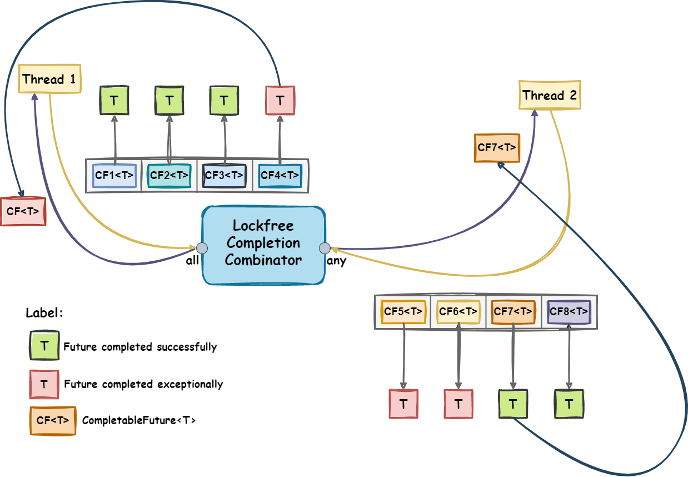 |
|:-----------------------------------------------------------------------------------------------:|
|                            *Lock-free Completion Combinator example*                            |

### Style of synchronization

The implementation uses a lock-free *retry* style of synchronization,
where a thread that sees a change of state will try to update the state of the combinator until it can
or sees that the state has already been updated by another thread.

The combinators implementation uses
the [TreiberStack](src/main/kotlin/pt/isel/pc/problemsets/sync/lockfree/TreiberStack.kt) data structure, which is a
lock-free stack.
A `toList` method was added to this stack to return a list of the elements in it. The method was also designed to be
lock-free,
although it will always provide a *snapshot* of the stack at the time of the call
and cannot guarantee the current state of the stack did not change after the call.

An implementation that is *lock-based*,
and that was the starting point of this implementation,
and the motive for the creation of the already mentioned `CompletionCombinator` interface,
is available [here](src/main/kotlin/pt/isel/pc/problemsets/sync/lockbased/LockBasedCompletionCombinator.kt).

An example of a *lock-based* and a *lock-free* implementations can be consulted in
this [section](#lock-based-vs-lock-free-algorithms).

### AggregationError

The [AggregationError](src/main/kotlin/pt/isel/pc/problemsets/sync/combinator/AggregationError.kt) is a custom exception
that is thrown when the `any` combinator is called and **all** of the input stages fail,
similar to
the [AggregateError](https://developer.mozilla.org/en-US/docs/Web/JavaScript/Reference/Global_Objects/AggregateError) in
JavaScript.

It contains a list of the exceptions that caused the failure of the input stages as a property.

```kotlin
class AggregationError(
    message: String,
    causes: List<Throwable>
) : Error(message) {
    val throwables: List<Throwable> by lazy(LazyThreadSafetyMode.PUBLICATION) { causes }
}
```

It was deemed necessary to provide a property
that returns a list of exceptions that caused the failure of each input stage.
To achieve this,
the property was implemented as a [lazy](https://kotlinlang.org/docs/delegated-properties.html#lazy-properties)
property,
meaning the list is only created if and when the property is called.

Additionally, `LazyThreadSafetyMode.PUBLICATION`
was used to provide thread-safe publication of the lazily initialized property.
This means that once the throwables property is computed,
all subsequent threads accessing it will see the same value without any synchronization overhead.

### Normal Execution

- A thread calls the `all` method and passes a list of `CompletionStage` implementations, expecting a list of input
  stages as a result.
- A thread calls the `any` method and passes a list of `CompletionStage` implementations, expecting a single input stage
  as a result.

### Conditions of execution

`all`:

- For all input stages in this combinator, a handler was added to each stage, that executes when the stage
  completes, and in that handler a few paths can be associated:
    - **fast-path**
        - the entire list of input stages was already added to the `futureToReturn` that is returned by
          this combinator, so this thread returns immediately.
    - **retry-path-on-failure**
        - the `futureToReturn` is not yet complete, and this thread sees the stage completed
          exceptionally, and as such it tries to mark the `futureToReturn` as *completed*, but enters a retry
          cycle since another thread might have already done that in the meantime. If the thread is successful
          in marking the `futureToReturn` as *completed*, it will complete it exceptionally with the exception
          that caused the failure of the input stage and return.
    - **retry-path-on-success**
        - the `futureToReturn` is not yet complete, and this thread sees that all stages completed
          succesfully, and as such it tries to mark the `futureToReturn` as *completed*,
          but enters a retry cycle since another thread might have done that in the meantime.
          If the thread is successful in marking the `futureToReturn` as *completed*, it will complete
          it successfully with the list of results and return.

`any`:

- For all input stages in this combinator, a handler was added to each stage, that executes when the
  stage completes, and in that handler a few paths can be associated:
    - **fast-path**
        - the `futureToReturn` that is returned by this combinator was already completed, so this thread
          returns immediately.
    - **retry-path-on-success**
        - the `futureToReturn` is not yet complete, and this thread sees that the stage associated with
          the handler completed succesfully, and as such it tries to mark the `futureToReturn` as *completed*,
          but enters a retry cycle since another thread might have done that in the meantime.
          If the thread is successful in marking the `futureToReturn` as *completed*,
          it will complete it successfully with the result of the input stage and return.
    - **retry-path-on-failure**
        - the `futureToReturn` is not yet complete, and this thread sees that all stages completed
          exceptionally, and as such it tries to mark the `futureToReturn` as *completed*, but enters a
          retry cycle since another thread might have already done that in the meantime. If the thread
          is successful in marking the `futureToReturn` as *completed*, it will complete it exceptionally
          with an `AggregationError` containing a list of the exceptions that caused the failure of each
          input stage and return.

## Set-3

In this set,
the main goal is to implement a server system with a `TCP/IP` interface for exchanging messages between clients and
a server, using the `coroutines` concurrency mechanism,
instead of `threads` to handle each client's connection, in order to improve the scalability and performance of the
system.

### Base Implementation Design

A base implementation of the entire system was provided in order to facilitate the development of the solution,
and uses the following design:

- Each server instance has a **accept thread** to listen for new connections and creates a client instance for each.
  Most of
  the time, this thread will be blocked waiting for a new connection to be accepted by the server.

- Each client instance uses **two** threads:
    - a **main thread** that reads and processes control-messages from a control queue. These control messages can be:
        - A text message posted to a room where the client is present.
        - A text line sent by the remote connected client.
        - An indication that the read stream from the remote-connected client ended.
        - An indication that the handling of the client should end (e.g., because the server is ending).
    - a **read thread** that reads lines from the remote client connection and transforms these into control messages
      sent to the main thread.
- Most interactions with the client are done by sending messages to the client control queue.

This design has two major drawbacks:

- the server thread is blocked when waiting for a new connection to be accepted.
- it uses a *threads* per connection, requiring two platform threads per connected client. Both client threads are
  blocked when
  reading the bytes that correspond to a client message from the socket and when
  reading from the control message queue, respectively.

A solution to these drawbacks is presented in this [section](#solution).

The following image illustrates how the base implementation internally works with the intention of visually representing
the mentioned drawbacks of the design:

| 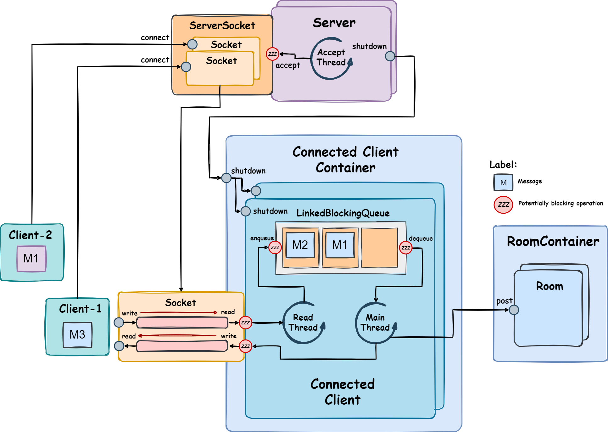 |
|:------------------------------------------------------------:|
|           *Base implementation of the application*           |

### Functionality

#### Base Functionality

Client systems interact with the server system by sending lines of text, which can be **commands** or **messages**.
A command begins with `'/'`, followed by the command name and zero or
more arguments, whereas a message is any line of text that does not begin with `'/'`.

The server system is organized into `rooms`. Each client system can be in zero or one room.
After the first connection, client systems are not in any room, and must join one if they wish to send or receive
messages from other clients.
When a client is in a room, it can send messages to that room and will receive all the messages sent by other clients
present in that room.

The commands a client system can send over a `TCP/IP` connection are:

- `/enter <room-name>` - enters the room <room-name>, creating it if necessary.
- `/leave` - leave the room it is in.
- `/exit` - terminates the connection to the server.

#### Additional Functionality

The system must also accept the following commands sent locally via standard input:

- `/shutdown timeout` - starts the server shutdown process, no longer accepting connections but
  waiting for all connections to terminate within the given timeout seconds. All clients should receive a message
  notifying
  that the shutdown process has started. If there are still clients connected after timeout seconds, the server should
  abruptly terminate.
- `/exit` - abruptly terminates the server.

### Requirements

The developed system should meet the following requirements:

- use a number of threads there are appropriate to the computational capacity and not proportional to the number of
  connected clients.
- continue to handle a large number of clients simultaneously.
- not block the threads that handle the client connections or any other threads in the system unless absolutely
  necessary.
- provide application-level commands to terminate the server gracefully and abruptly.

### Solution

In order to provide a solution to the problem, the following steps were taken:

- A [AsyncMessageQueue](#asyncmessagequeue) class was implemented
  to provide a syncronized communication mechanism between coroutines,
  since the previous,
  [LinkedBlockingQueue](https://docs.oracle.com/javase/8/docs/api/java/util/concurrent/LinkedBlockingQueue.html)
  class
  used in the base implementation of the `control queue`, namely in
  the [ConnectedClient](src/main/kotlin/pt/isel/pc/problemsets/set3/base/ConnectedClient.kt) class,
  does not provide **coroutine synchronization**, and thus, it was replaced.
- In order to disallow the threads that are reading from the socket to be blocked while the socket is out of bytes,
  the implementations of the channels used in the base implmentation:
  [ServerSocket](https://docs.oracle.com/javase/8/docs/api/java/net/ServerSocket.html)
  and [Socket](https://docs.oracle.com/javase/8/docs/api/java/net/Socket.html) could be
  changed to their asynchronous
  counterparts from the **NIO2** package,
  [AsynchronousServerSocketChannel](https://docs.oracle.com/javase/8/docs/api/java/nio/channels/AsynchronousServerSocketChannel.html)
  and [AsynchronousSocketChannel](https://docs.oracle.com/javase/8/docs/api/java/nio/channels/AsynchronousSocketChannel.html),
  respectively.
  Although this modification could solve the presented issue, it's still necessary to provide a way
  for these socket implementations to synchronize with the coroutine ecosystem
  already in use for other application contexts, like the message queue mentioned above.
  For that reason, several [asynchronous socket extension functions](#asynchronous-socket-extension-functions) were
  implemented
  to provide an interface that not only takes advantage of the asynchronous implementation of the mentioned sockets,
  but also knows the coroutine system, works with it and is sensible to its effects.
- In terms of switching from threads to coroutines, the following changes were made:
    - The `accept-thread` of the [Server](src/main/kotlin/pt/isel/pc/problemsets/set3/base/Server.kt) class was replaced
      by a coroutine, which then launches a new coroutine for each accepted connection.
      The client coroutine is launched within
      a [supervisorScope](https://kotlin.github.io/kotlinx.coroutines/kotlinx-coroutines-core/kotlinx.coroutines/supervisor-scope.html)
      block,
      so that if the client coroutine fails and propagates its cancellation, the server coroutine is not cancelled,
      and can continue to accept new connections.
    - Both `main-thread` and `read-thread` of
      the [ConnectedClient](src/main/kotlin/pt/isel/pc/problemsets/set3/base/ConnectedClient.kt) class were replaced by
      coroutines. In order to take advantage of the coroutine hierarchy with default cancellation
      propagation, the read coroutine was made a child of the main coroutine,
      so that if the read coroutine fails or is canceled, the main
      coroutine is also cancelled, and thus, the client coroutine is cancelled as well.
    - The application coroutine hierarchy is represented in the following image:

      | 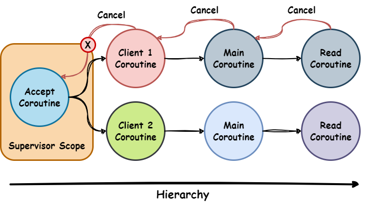 |
      |:-----------------------------------------------------------------------------------:|
      |                          *Application Coroutine Hierarchy*                          |

- Besides the base implementation, these utility classes were also provided:
    - [LineParser](src/main/kotlin/pt/isel/pc/problemsets/line/LineParser.kt): This class receives CharBuffers and
      provides strings that are partitioned by line breaks. It maintains
      a StringBuilder to hold the current line being parsed and a NodeLinkedList to store the already parsed lines. The
      class offers a poll() method to retrieve the parsed lines, and it internally handles line terminators to extract
      complete lines.
    - [LineReader](src/main/kotlin/pt/isel/pc/problemsets/line/LineReader.kt): This class provides a suspendable
      `readLine` interface on top of a suspend function that reads bytes.
      It
      uses a `LineParser` internally to parse the received bytes into lines. It utilizes `ByteBuffer` and `CharBuffer`
      for
      efficient byte-to-character decoding using a specified character set. The class ensures that the byte buffer is
      appropriately sized and handles underflows during decoding. The `readLine` method retrieves lines from the
      LineParser
      and returns them as strings, or null if there are no more lines to read.
- In order to provide application-level commands to terminate the server gracefully and abruptly, the following
  changes were made:
    - The [Server](src/main/kotlin/pt/isel/pc/problemsets/set3/base/Server.kt) class was modified to provide a
      timeout `shutdown` method, which starts the shutdown process and tries to terminate the server gracefully.
    - The `exit` command was modified to call the `shutdown` method with
      no timeout, which will cause the server to terminate abruptly.
    - An [AppCommand](src/main/kotlin/pt/isel/pc/problemsets/set3/solution/AppCommand.kt) class was created to
      represent the supported application-level commands, which is similar
      to [ClientRequest](src/main/kotlin/pt/isel/pc/problemsets/set3/base/ClientRequest.kt) already present in the
      base implementation.
    - In the [App](src/main/kotlin/pt/isel/pc/problemsets/set3/base/App.kt), a new coroutine that runs in
      parallel with
      the coroutine that is waiting for the server to terminate was added
      to listen for application-level commands sent via standard input and act accordingly.
      Since `readline` is a blocking operation, a suspendable version was implemented, following the same
      approach used in the asynchronous socket extension functions.
- In the [Server](src/main/kotlin/pt/isel/pc/problemsets/set3/base/Server.kt) class constructor, a parameter that
  represents the `number of threads` was added.
  In addition, the same parameter is used to create a
  [ThreadPoolExecutor](https://docs.oracle.com/javase/8/docs/api/java/util/concurrent/ThreadPoolExecutor.html)
  with a fixed number of threads, which is then used as:
    - a [AsynchronousChannelGroup](https://docs.oracle.com/javase/8/docs/api/java/nio/channels/AsynchronousChannelGroup.html)
    to be used by
    the [AsynchronousServerSocketChannel](https://docs.oracle.com/javase/8/docs/api/java/nio/channels/AsynchronousServerSocketChannel.html) `open`
    method.
    - a [CoroutineDispatcher](https://kotlin.github.io/kotlinx.coroutines/kotlinx-coroutines-core/kotlinx.coroutines/-coroutine-dispatcher/index.html)
    that provides the coroutine context for the server coroutine.
    It's also worth mentioning that the executor `shutdown` and `awaitTermination` methods are called in the newly
    added `shutdown` with timeout method, so that the server can terminate gracefully within that timeout.

The following image illustrates how the solution was implemented, with the mentioned modifications identified.

| 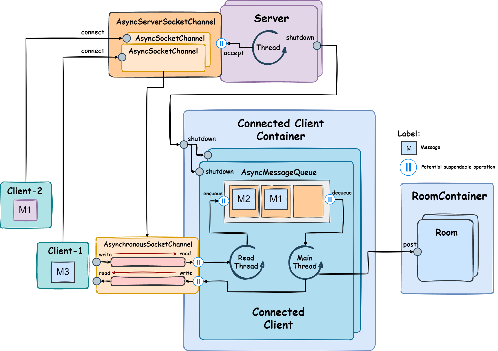 |
|:--------------------------------------------------------------------:|
|                          *Solution preview*                          |

### AsyncMessageQueue

[Implementation](src/main/kotlin/pt/isel/pc/problemsets/set3/solution/AsyncMessageQueue.kt) |
[Tests](src/test/kotlin/pt/isel/pc/problemsets/set3/AsyncMessageQueueTests.kt)

### Description

This synchronizer is a queue that provides **suspendable** methods for the enqueue and dequeue operations,
which means no thread is blocked while waiting for any operation to complete. It was designed to provide a
synchronization mechanism between producer and consumer coroutines.

The queue:

- **is bounded**, meaning that it has a maximum capacity of elements that can be enqueued at a given time.
- allows for each coroutine to specify a *willing-to-wait* **timeout** for the dequeue operation to complete.
- is sensible to **coroutine cancellation**.

Since in a real environment, it is important to ensure the messages are enqueued and dequeued in the order of arrival,
the queue was implemented using FIFO (*First In First Out*) ordering.

### Public interface

```kotlin
class AsyncMessageQueue<T>(private val capacity: Int) {
    @Throws(CancellationException::class)
    suspend fun enqueue(message: T): Unit

    @Throws(TimeoutException::class, CancellationException::class)
    suspend fun dequeue(timeout: Duration): T
}
```

In the following image, an example can be seen of the iteraction between the producer and consumer coroutines
with the queue.
The diagram assumes this order of events:

- The **producer 4** coroutine enqueues a message.
- The **producer 5** coroutine suspends its execution, because the queue was full.
- The **consumer 1** coroutine dequeues a message and resumes the **producer 5** coroutine request to enqueue a message.

| 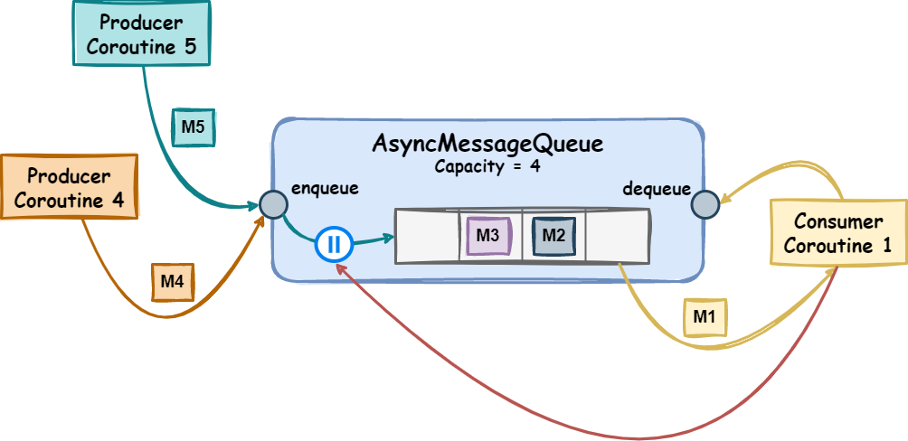 |
|:----------------------------------------------------------------------------:|
|                      *AsynchronousMessageQueue example*                      |

### Style of synchronization:

For this synchronizer the `Kernel-style` or `Delegation of
Execution` was used, since the coroutine that cannot complete its request immediately
delegates its execution to another coroutine, which might be able to complete it later.
Similar to the [BlockingMessageQueue](#blockingmessagequeue),
this queue also uses the same strategy of having a request object for each of the supported operations:

- `ProducerRequest` - represents a *Producer Coroutine* request to enqueue a message.

  ```kotlin
  private class ProducerRequest<T>(
    val message: T,
    val continuation: CancellableContinuation<Unit>,
    var canResume: Boolean = false
  )
  ```

- `ConsumerRequest` - represents a *Consumer Coroutine* request to dequeue a message.

  ```kotlin
  private class ConsumerRequest<T>(
    val continuation: CancellableContinuation<T>,
    var message: T? = null,
    var canResume: Boolean = false
  )
  ```

Both of these request objects have the following properties:

- a **resume flag** that is used to indicate whether the coroutine that made the request can resume its execution or
  not.
- the **continuation** of the coroutine that made the request, so that it can be explicitly resumed when the request is
  completed or canceled.

### Normal execution:

- A coroutine calls `enqueue` and expects to enqueue a message.
- A coroutine calls `dequeue` and expects to dequeue a message within the given timeout.

### Conditions of execution:

`enqueue`:

- **Paths** - The coroutine can take two major paths when calling this method:
    - the *message queue* is not full, and the coroutine is the head of the *producer requests queue*, and as such, the
      thread can enqueue the message without suspending (**fast-path**).
    - the coroutine is not the head of the *producer requests queue*, and as such, the coroutine is suspended until it
      is explicitly resumed (**resume-path**).
- **Cancellation** - A coroutine that is canceled while suspended in the *producer requests queue* is removed from the
  queue and resumed with `CancellationException`, unless it was marked to be resumed by another coroutine, and as such,
  it will still enqueue the message, but will keep the `CancellationException` in its context.

`dequeue`:

- **Paths** - The coroutine can take two major paths when calling this method:
    - **fast-path**
        - the *message queue* is not empty, and the coroutine is the head of the *consumer requests queue*, and as such,
          the coroutine can dequeue the message without suspending.
        - no timeout was provided, and as such, the coroutine resumes immediately with `TimeoutException`.
    - **resume-path** - the coroutine is not the head of the *consumer requests queue*, and as such, the coroutine is
      suspended until it is explicitly resumed.
- **Cancellation** - A coroutine that is canceled while suspended in the *consumer requests queue* is removed from the
  queue and resumed with `CancellationException`, if its request was not completed yet, otherwise, it will resume with
  the message that was dequeued, but the `CancellationException` will be kept in its context.

**Additional notes**:

- The following notes apply to both queue operations:
    - the coroutine that alters the state of the queue is responsible for resuming the coroutine that placed the
      correspondent operation request (_Delegation style_) last in the queue (_FIFO_).
    - since no continuation method can be called inside a lock - because other continuations might be waiting for this
      continuation to resume and could hold the lock indefinitely - a resume flag was used to mark the coroutine
      as `resumable` in order to be resumed outside the lock.
- Racing conditions found:
    - between retrieving the message from the queue
      and executing the continuation of the consumer coroutine that made the request, the consumer coroutine might
      be canceled,
      and
      since [suspendCancellableCoroutine](https://kotlinlang.org/api/kotlinx.coroutines/kotlinx-coroutines-core/kotlinx.coroutines/suspend-cancellable-coroutine.html)
      was used in the implementation,
      the coroutine is immediately resumed with `CancellationException`,
      but in this context the message was already retrived from the queue, leading to a **lost message**.
      To solve this,
      a `try-catch` block was used in both implementations of the queue operations
      to catch the `CancellationException` and decide whether to return normally or to throw the exception,
      depending on whether the message was already retrieved from the queue.
    - since the `dequeue` operation is using
      the [withTimeoutOrNull](https://kotlinlang.org/api/kotlinx.coroutines/kotlinx-coroutines-core/kotlinx.coroutines/with-timeout-or-null.html)
      suspension block, a consumer coroutine request could complete but not return within the timeout, which could
      lead to the same problem as mentioned above. In order to solve it, the same approach was used as in the
      previous case, but if the request wasn't completed yet, the `TimeoutException` is thrown instead of
      the `CancellationException`.

### Asynchronous Socket Extension Functions

[Implementation](src/main/kotlin/pt/isel/pc/problemsets/set3/solution/AsyncSocketChannelExtensions.kt) | [Tests](src/test/kotlin/pt/isel/pc/problemsets/set3/AsyncSocketChannelExtensionsTests.kt)

### Description

These extension functions were implemented
in order to provide a way to perform I/O operations on a socket channel without blocking the calling thread,
which the
classes [AsynchronousSocketChannel](https://docs.oracle.com/javase/8/docs/api/java/nio/channels/AsynchronousSocketChannel.html)
and [AsynchronousServerSocketChannel](https://docs.oracle.com/javase/8/docs/api/java/nio/channels/AsynchronousServerSocketChannel.html)
already provide,
but are not synchronized nor operate in a coroutine context.

### Implementation

In normal conditions, the `AsynchronousSocketChannel` and `AsynchronousServerSocketChannel` classes provide a way to
perform I/O operations without blocking the calling thread, but instead use callbacks to notify the caller when the
operation is completed.
The callback is an object that implements
the [CompletionHandler](https://docs.oracle.com/javase/8/docs/api/java/nio/channels/CompletionHandler.html) interface,
which has two methods:

- `completed` - called when the operation is completed successfully.
- `failed` - called when the operation is completed with an error.

Since we are using coroutines, the extension functions were wrapped in
a [suspendCancellableCoroutine](https://kotlinlang.org/api/kotlinx.coroutines/kotlinx-coroutines-core/kotlinx.coroutines/suspend-cancellable-coroutine.html)
block,
which is sensitive to coroutine cancellation,
so that the coroutine can be suspended until the asynchronous I/O operation is completed,
and then explicitly resume inside the callback, with its result or exception that eventually occurred.

### Public interface

```kotlin
@Throws(CancellationException::class)
suspend fun AsynchronousServerSocketChannel.acceptSuspend(): AsynchronousSocketChannel

@Throws(CancellationException::class)
suspend fun AsynchronousSocketChannel.readSuspend(byteBuffer: ByteBuffer): Int

@Throws(CancellationException::class)
suspend fun AsynchronousSocketChannel.writeSuspend(byteBuffer: ByteBuffer): Int
```

### Normal execution:

- A coroutine calls `acceptSuspend` and expects to accept a connection.
- A coroutine calls `readSuspend` and expects to read data from the socket channel.
- A coroutine calls `writeSuspend` and expects to write data to the socket channel.

### Conditions of execution:

When a coroutine that calls `readSuspend` or `writeSuspend` is canceled, the byte buffer that was passed as an
argument to the respective function could still be in use by the underlying I/O operation
after the coroutine is resumed,
which could lead to
*resource leaks* or *data corruption*.
In order to prevent this,
a try-catch block was used to catch the `CancellationException` and **close the socket channel**
if the operation wasn't completed when the coroutine was canceled.
The `acceptSuspend` function has the same behavior,
even though it doesn't receive any resource as an argument,
it was deemed necessary to close the socket channel in response of `accept coroutine` being canceled.

## Demonstration

In order to demonstrate the implementation of the described [solution](#solution),
two small videos were recorded, to show both the client and server sides of the application.

### Client

For the client demonstration,
the [Termius](https://termius.com/) application was used to establish a `TCP/IP` connection to the server.
The video showcases the interaction of three clients using the application.
Later, one of the clients explicitly requests to exit,
while the other two are disconnected due to a termination request sent to the server shortly after.

https://github.com/isel-leic-pc/s2223-2-leic41d-FranciscoEngenheiro/assets/101189781/2be12b52-e29e-49f1-9cd1-72973d50e711

### Server

In the server demonstration, the usage of the application-level supported [commands](#additional-functionality) can be
observed.

https://github.com/isel-leic-pc/s2223-2-leic41d-FranciscoEngenheiro/assets/101189781/f2f394df-a036-40bb-944a-9a9f924ee583