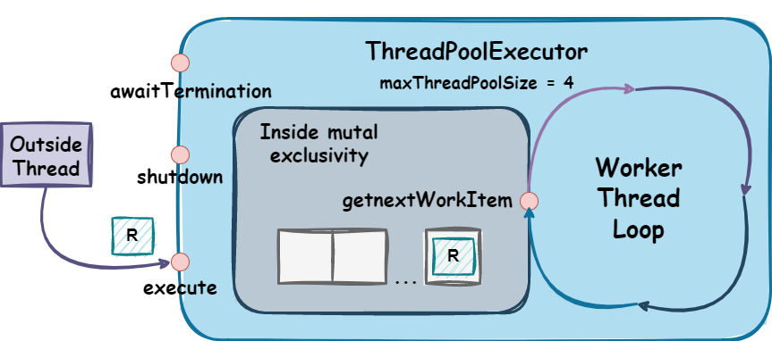
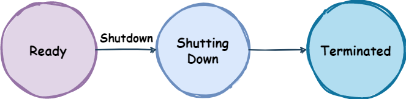

# Concurrent Programming - Summer 22/23

> This document contains the relevant observations and technical documentation of the problem sets resolution.

- Student: `49428 - Francisco Engenheiro - LEIC41D`

## Table of Contents 
- [Set1](#set1)
  - [NAryExchanger](#naryexchanger)
  - [BlockinMessageQueue](#blockingmessagequeue)
  - [ThreadPoolExecutor](#threadpoolexecutor)

## Set1
### NAryExchanger
#### Description
This exchanger implementation is similar to the [Java Exchanger](https://docs.oracle.com/javase/7/docs/api/java/util/concurrent/Exchanger.html), but it allows to exchange generic values between 
an arbitrary group of threads instead of just two. It also allows for each thread to specify a willing-to-wait 
timeout for the exchange operation to complete.

The exchanger is able to create multiple groups of threads with the same specified size upon creation,
and each thread can only exchange values with the threads of its group.

A group is completed if the number of threads required to complete the group equals the specified group size.

#### Public Interface:
```kotlin
class NAryExchanger<T>(groupSize: Int) {
    @Throws(InterruptedException::class)
    fun exchange(value: T, timeout: Duration): List<T>?
}
```

In the following image, an example can be seen of such iteraction between the exchanger and a set of threads.

|  |
|:------------------------------------------------------:|
|                *NAryExchanger example*                 |

#### Style of syncronization: 
- For this syncronizer the `Kernel-style` or `Delegation of execution` was used in form of a `Request`, which 
represents a group in this context.
- A delegation of execution was used, because it's easier for the thread that completes the group to signal all the other threads of that group, that such condition is now true, thus completing their request, and as such, the other threads in the group aren't 
required to alter the state of the `Exchanger` or their own state when they return from *await* (as they would in `Monitor Style`)
- The described `Request` is defined as follows:

    ```kotlin
    private class Request<T>(
        val condition: Condition,
        val values: MutableList<T> = mutableListOf(),
        var isGroupCompleted: Boolean = false
    )
    ```

#### Normal execution:
- A thread calls `exchange` and awaits, within a timeout duration, for `groupSize` threads to call `exchange` as well.
- When `groupSize` threads have called `exchange`, the values are exchanged and the threads resume their respective work.

#### Conditions of execution:
- **Paths** - The thread can take two major paths when calling `exchange`:
    - the thread is the last thread to join the group, thus completing it, and as such, it returns with the exchanged values (***fast-path***).
    - a group is not ready to be completed, the thread passively awaits for that condition to be true (***wait-path***). 
- **Giving-up** - While waiting, a thread can *give-up* on the exchange operation if:
    - the thread is interrupted while waiting for the group to be completed and throws an `InterruptedException`.
    - the thread willing-to-wait timeout expires and returns `null`.
- **Additional notes**:
    - If a thread is interrupted but the group is completed, it will still return the exchanged values but will throw an `InterruptedException` if blocked again. 
    - A thread that specifies a timeout of *zero* will not wait for the group to be completed and will return `null` immediately if it did not complete the group.
  
### BlockingMessageQueue
#### Description
This syncronizer is a blocking queue,
similar to an [ArrayBlockingQueue](https://docs.oracle.com/javase/7/docs/api/java/util/concurrent/ArrayBlockingQueue.html)
that allows for multiple threads to concurrently enqueue and dequeue messages.
It also allows for each thread to specify a willing-to-wait timeout for the enqueue and dequeue operations to complete.

The term *blocking* refers to the fact that the queue is bounded,
and as such, if a thread tries to enqueue a message when the queue is full,
or tries to dequeue a message when the queue is empty,
it will block until the queue is not full or not empty, respectively.

This type of syncronizer is useful when dealing in scenarios with multiple producers and consumer threads that want to exhange messages,
and as such, it is important to ensure that those messages are enqueued and dequeued in the order of arrival,
because of that the queue was implemented using FIFO (*First In First Out*) ordering.

#### Public Interface:
```kotlin
class BlockingMessageQueue<T>(private val capacity: Int) {
    @Throws(InterruptedException::class)
    fun tryEnqueue(message: T, timeout: Duration): Boolean
    @Throws(InterruptedException::class)
    fun tryDequeue(nOfMessages: Int, timeout: Duration): List<T>?
}
```

In the following image, an example can be seen of the iteraction between the blocking queue and a set of producer and consumer threads.

|  |
|:--------------------------------------------------------------------:|
|                    *BlockingMessageQueue example*                    |

#### Style of syncronization:
- For this syncronizer the `Kernel-style` or `Delegation of execution` was used in form of several `Requests`, which one representing a different condition:
  - `ProducerRequest` - represents a request to enqueue a message.
  
    ```kotlin
    private class ProducerRequest<T>(
        val message: T,
        val condition: Condition,
        var canEnqueue: Boolean = false
    )
    ```
  - `ConsumerRequest` - represents a request to dequeue a set of messages.
  
    ```kotlin
    private class ConsumerRequest<T>(
        val nOfMessages: Int,
        val condition: Condition,
        var messages: List<T> = emptyList(),
        var canDequeue: Boolean = false
    )
    ```
- The delegation is used in the sense where the consumer thread that dequeues the messages is the one that signals a producer
thread and completes its request if it can be completed, because it altered the state of the syncronizer and because of that
it might have created conditions that allow other threads to complete their requests. This process works in both ways, 
where a producer thread can complete a consumer request if it can be completed.

#### Normal execution:
- A thread calls `tryEnqueue` and expects to enqueue a message within the given timeout. 
- A thread calls `tryDequeue` and expects to dequeue a set of messages within the given timeout.

#### Conditions of execution:
`TryEnqueue`:
- **Paths** - The thread can take two major paths when calling this method:
    - **fast-path** 
        - there's a consumer thread that is waiting to dequeue a single message, and as such, the thread delivers the message directly and returns `true`.
        - the *message queue* is not full, and the thread is the head of the *producer requests queue*, the thread enqueues the message and returns `true`.
    - **wait-path** - the *message queue* is full, or the thread is not the head of the *producer requests queue*, and as such, the thread passively awaits to be able to enqueue the message.
- **Giving-up** - While waiting, a thread can *give-up* on the enqueue operation if:
    - the thread is interrupted while waiting for the queue to be not full and throws an `InterruptedException`.
    - the thread willing-to-wait timeout expires and returns `false`.
- **Additional notes**:
    - If a thread is interrupted but another thread completed this thread request to enqueue a message, it will still return `true` but will throw an `InterruptedException` if blocked again.
    - A thread that specifies a timeout of *zero* will not wait and will return `false` immediately if it did not enqueue the message.

`TryDequeue`:
- **Paths** - The thread can take two major paths when calling this method:
    - the *message queue* has at least `nOfMessages` messages, and the thread is the head of the *consumer requests queue*, the thread dequeues the messages and returns them (***fast-path***).
    - the *message queue* has less than `nOfMessages` messages, or the thread is not the head of the *consumer requests queue*, and as such, the thread passively awaits to be able to dequeue the messages (***wait-path***).

- **Giving-up** - While waiting, a thread can *give-up* on the dequeue operation if:
    - the thread is interrupted while waiting for the queue to be not empty and throws an `InterruptedException`.
    - the thread willing-to-wait timeout expires and returns `null`.

- **Additional notes**:
    - If a thread is interrupted but another thread completed this thread request to dequeue a set of messages, it will still return those messages, but will throw an `InterruptedException` if blocked again.
    - A thread that specifies a timeout of *zero* will not wait and will return `null` immediately if it did not dequeue the number of requested messages.

### ThreadPoolExecutor
#### Description
This syncronizer is similar to the Java [ThreadPoolExecutor](https://docs.oracle.com/javase/7/docs/api/java/util/concurrent/ThreadPoolExecutor.html)
that allows outside threads to delegate the execution of a task to other threads - *worker threads* - that it manages.

The thread pool has a static worker thread pool size,
meaning that it has a maximum number of worker threads that can be created to execute received tasks.

The worker threads are created lazily,
and are kept alive for the specified time interval, after which they're terminated.

The thread pool has a task bounded queue, which is a blocking queue that holds the tasks that are delegated to the thread pool. If a thread tries to execute a task when the thread pool is full,
it will block until a thread is available to execute that task.

#### Public Interface
```kotlin
class ThreadPoolExecutor(
    private val maxThreadPoolSize: Int,
    private val keepAliveTime: Duration,
) {
    @Throws(RejectedExecutionException::class)
    fun execute(runnable: Runnable)
    fun shutdown()
    @Throws(InterruptedException::class)
    fun awaitTermination(timeout: Duration): Boolean
}
```

The following image shows how a task, that is delegated to a worker thread is executed within the thread pool.

|  |
|:-----------------------------------------------------------------:|
|                   *ThreadPoolExcecutor example*                   |

#### Lifecycle
The executor has a lifecycle that can be described by the following states:
- **Execution** - the executor is accepting tasks to be executed. Outside threads can delegate tasks to the thread pool using the `execute` method.
- **Shutdown** - the executor is not accepting tasks to be executed, but it's still executing the tasks that were already delegated to it, by the order they were delagated. This process is started by calling the `shutdown` method.
- **Termination** - the thread pool has finished the shutdown process and terminates. All tasks that were delegated to it prior to the shutdown process have been executed with success or failure. An outside thread can syncronize with this termination process by calling the `awaitTermination` method.

  |  |
  |:-------------------------------------------------------------:|
  |                  *ThreadPoolExecutor states*                  |

#### Style of syncronization:
- For this syncronizer the `Kernel-style` or `Delegation of execution` was used in form of a `Request`, which
  represents a worker thread request to execute a task.
- The described `Request` is defined as follows:     
    ```kotlin
    private class WorkerRequest(
        val condition: Condition,
        var canExecute: Boolean = false         
    )
    ```
  
#### Normal execution:
- A thread calls `execute` and leaves, expecting the task to be executed by a worker thread within the time limit.
- A thread calls `shutdown`, expecting the thread pool to starting shutting down.
- A thread calls `awaitTermination` and awaits, for a time duration, for the thread pool to terminate.

#### Conditions of execution:
- TODO()
